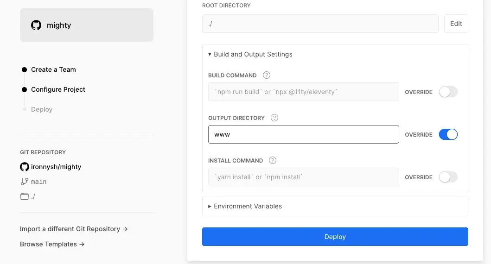
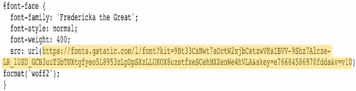

# Mighty Eleventy Starter


## Summary

**Mighty** is using [Eleventy (11ty)](https://www.11ty.dev) to build a one-pager or landing page—a simple, elegant theme from which freelancers or small businesses can generate their individual one-pagers.

[Click here to see a demo of the site.](https://mighty-site.vercel.app)

## Features

- Responsive, fluid layout (without media queries).
- Minimal architecture: HTML, CSS, and vanilla JavaScript—no other frameworks or build tools besides 11ty.
- Advanced SEO: [Open Graph]( https://ogp.me/) meta tags for social share on Facebook and Twitter and [JSON-LD]( https://developers.google.com/search/docs/guides/intro-structured-data) schema for search engines.
- _Lite YouTube_ script that loads videos embedded from YouTube only when the user clicks them.
- Automatically optimized images.
- Minified code.
- Maximized performance.
- Semantic and accessible markup.
- Supports RTL layout.
- Built in cache and security configuration.

### Table of Contents

To adapt the theme to your needs, please follow this guide.

- [Getting started](#getting-started)
- [Customize](#customize-and-edit-the-content-color-schemes-and-fonts)
- [Tips](#tips)
- [Epilogue](#epilogue)
- [Contributions](#contributions)
- [Directory structure](#directory-structure)
- [File overview](#file-overview)

## Getting started

* If this is your first time working with Eleventy, static site generators (SSG), GitHub, or Node, it might be a good idea to start with [Tatiana Mac's comprehensive tutorial](https://www.tatianamac.com/posts/beginner-eleventy-tutorial-partii/). The multi-part series is titled __Beginner's Guide to Eleventy__, but it's packed with incredibly useful information about all things web-dev. Highly recommended read.

### 1. Clone this repository and install the project dependencies
Copy the snippet below and paste it into your device's terminal to create a local copy of the site and install the project dependencies. Change `your-project-name` to your site's name.

```
git clone --depth=1 https://github.com/ironnysh/mighty.git your-project-name
cd your-project-name
npm install
```

**Or**

### 1.1 Generate a repository from the template
Click the green `Use this template` button on the top to generate a repository under your GitHub account and copy all files into your new project.

### 1.2 Create a local copy and install the project dependencies
Copy the snippet below and paste it into your device's terminal to create a local copy of the site and install the project dependencies. Change `your-project-name` to your site's name.

```
cd your-project-name
npm install
```

### 2. Run Eleventy
#### Locally (development)
Copy the snippet below and paste it into your device's terminal to generate a local copy of the site in the `www` directory. The files automatically update whenever you make changes:

```
npm start
```
Open your browser and type `http://localhost:8080` in the address bar to see your site.

#### Hosting (production)
When you're ready to deploy your site to a hosting provider, copy and paste the snippet below into your preferred hosting platform's settings section.

It will generate a remote copy of the site in the `www` directory (*note: If you plan to use Vercel, you'd have to specify it in the dashboard. See the screenshot below).

```
npm run build
```
[Vercel](https://vercel.com) is my preferred hosting provider, but you can use any other service that supports static sites, including [Netlify](https://www.netlify.com), [Render](https://render.com), and [Cloudflare Pages](https://pages.cloudflare.com).

Click the button to host your site on Vercel:

[](https://vercel.com/new/clone?repository-url=https://github.com/ironnysh/mighty.git)

This is what you should see after clicking the button. Note the override of the default _OUTPUT DIRECTORY_:


## Customize and edit the content, color schemes, and fonts

### Edit the content
There are three files to edit (see the [File overview](#file-overview) below for details):
1. `src/_data/settings.json` - change the values to the right of the colon of each key. E.g., `url` should be your site's address, `author` should be your name, `phoneNumber` should be your number (change `phoneCall` accordingly, keeping the format to allow tap-to-call on mobile), etc. This is also where you can change the labels of the top navigation. E.g., `products` and `work` instead of `services` and `portfolio`.
2. `src/_data/texts.json` - text displayed on the homepage: title and paragraphs of the **About** section; titles and summaries of the **Services** section; titles, summaries, and video IDs for the *Portfolio*; and privacy policy references. You can change the values to the right of the colon of the `title`, `summary`, and `videoID` keys. Unless you plan to add an analytics service, you can leave the privacy section as-is.
#. `src/imprint.md` - your personal details and contact information (Masthead) are generated automatically based on the details provided in the `_data/settings.json`. Unless you plan to add analytics or other tracking services, you can leave the _Data Protection_ and _GDPR_ sections as-is. The other privacy references on the page are generated automatically based on the information provided in the privacy section of the `_data/texts.json`. You can update the relevant credits under the _Colophon_ according to your sources and service providers.

*Note: you can delete this `README` file, as well `subset-google_fonts.webp`, `delpoy-to-vercel.webp`, and `mighty-demo-screenshot.webp`. These files are here to help you set up the site.

### Change colors and fonts
Open `src/_includes/utilities/style.css` and edit any CSS attribute you'd like.

The most relevant parts are probably the colors and fonts:
1. All the colors are defined as CSS variables on the top. Change the `hsl` values to the color scheme you want.
2. We use three fonts (see the [File overview](#file-overview) below). If you delete or replace any of them, update the references in two places: the `@font-face` rules at the top of the CSS file and the `font-family` variable. There are fallback system fonts for each.
**Important**: for better performance, the fonts are preloaded in the `head` of the main layout (`src/_includes/layouts/default.njk`)—delete or update these lines according to the fonts you use.

### Contact icons
You can replace the SVG files of the icons, and add others. For example, Instagram instead of Twitter (*note that the current design only accommodates three icons).

You can either include a new SVG file in `src/_includes/svg` or paste the code directly into the existing file. If you add a new file of a service that doesn't exist (For example, Instagram), provide your relevant details in `src/_data/settings.json` and update it accordingly in the code (it's recommended to use the `Find and Replace` option of your code editor).

### Replace images and fonts
The `src/assets` folder includes all the non-code files: fonts, images, and favicon. You can replace these with your graphics and fonts. Please note: if you decide to change the names of the images, update them accordingly in the code (it's recommended to use the `Find and Replace` option of your code editor).

## Tips
**Language**: For a non-US English site, set the language in the first line of `src/_data/settings.json`. Check out the [complete list of language and country codes](https://www.fincher.org/Utilities/CountryLanguageList.shtml) and copy the appropriate one. Setting it to Hebrew (he-IL) does require other fonts, but the layout will automatically adapt to right-to-left (RTL).

**Social Image**: you can use a service like [Thumbnail.AI](https://thumbnail.ai) to generate a social image.

**Optimize Fonts**: _Fredericka the great_ is a large font file, even when limited to the Latin alphabet. You can optimize it further by downloading a "leaner" version of it from Google Fonts. Follow these steps:
1. Copy the line below:
```
https://fonts.googleapis.com/css?family=Fredericka+the+Great&text=YOUR-LETTERS-HERE
```
2. Replace the `YOUR-LETTERS-HERE` after the `text=` part with the letters you need for the heading (right now, it's "Every Story is Interesting if you Know How to Tell it") making sure you don't repeat any letter. I.e., `EveryStoisIngfuKwHTl` for the sentence above.
3. Paste the whole URL into your browser address bar (the Google Fonts link and your letters) and hit `Enter`.
4. You'll see a plain HTML page with a few lines of code. Copy the part inside the parentheses after `src: url`. See the yellowed line in the screenshot:



5. Paste this URL you copied into your browser address bar, hit `Enter`, and save the optimized font file to your device.
6. Rename the downloaded file to `fredericka-the-great-subset`, copy it, and paste it into your site's `src/assets` folder to replace the current file.

This might seem daunting or a waste of time, but it's less complicated than it seems, and is definitely worth it. For example , the `EveryStoisIngfuKwHTl` subset version of the font is **36 kb** instead of **110 kb**! Major performance gains for you and your site's visitors.

## Epilogue
I started working on the first version of this project around April 2020, when Covid-19 came to town, and the world suddenly stopped. I had just discovered a thing called Eleventy, "a simpler static site generator." (The developer, [Zach Leatherman](https://twitter.com/zachleat), wasn't lying.)

Soon after I started tinkering with it, I noticed Eleventy had a nice side effect: it brought back the joy of building sites.

Now, after (gradually) overcoming my impostor syndrome, I want to give back to this incredible community (open source in general, and [Eleventy](https://discord.com/invite/GBkBy9u) in particular): I'm releasing this project under [MIT/CC BY-NC-SA 4.0 License](LICENSE).

Have fun, and I hope you find it interesting and valuable.

## Contributions

You're welcome to contribute to this project. Feel free to open an issue if you have questions or find a bug.

---

## Directory structure

```
.
├── src
│   └── _data
│       └── texts.json
│       └── settings.json
│       └── helpers.js
│   └── _includes
│       └── layouts
│           └── default.njk
│       └── svg
│           └── email.svg
│           └── phone.svg
│           └── twitter.svg
│       └── utilities
│           └── schema.njk
│           └── style.css
│           └── liteYoutube.js
│       └── about.njk
│       └── contact.njk
│       └── footer.njk
│       └── header.njk
│       └── portfolio.njk
│       └── services.njk
│       └── 
│   └── assets
│       └── catamaran.woff2
│       └── favicon.svg
│       └── fredericka-the-great-subset.woff2
│       └── patua-one.woff2
│       └── social-image.jpg
│       └── hero-image.webp
│   └── imprint.md
│   └── index.njk
│   └── robots.njk
├── .github
│   └── workflows
│       └── calibreapp-image-actions.yml
│   └── dependabot.yml
├── eleventy.config.js
├── .gitignore
├── LICENSE
├── README.md
├── Subset-google_fonts.webp
├── mighty.webp
├── vercel_delpoy.webp
└── package.json
└── vercel.json

```

## File overview

`root`:
- `eleventy.config.js` - general 11ty configuration.
- `.gitignore` - files that you do not want to upload to GitHub.
- `README.md` - the document you're currently reading.
- `LICENSE` - the open-source license.
- `Subset-google_fonts.webp` - a screenshot of a CSS code for a subsetted font from Google Fonts.
- `vercel_delpoy.webp` -  a screenshot of Vercel's deployment settings window.
- `mighty.webp` -  a screenshot of the demo site. 
- `package.json` - general information about the repository, scripts, and dependencies.

`.github`:
- `dependabot.yml` - GitHub's automatic updates of dependencies.

`.github/workflows`:
- `calibreapp-image-actions.yml` - Calibreapp's GitHub Action compresses and optimizes images. It's triggered on pull-requests, when a JPG/WebP file changes. [See information and optional configuration](https://github.com/marketplace/actions/image-actions).

`src`:
- `imprint.md` - text for the Imprint & privacy policy page.
- `index.njk` - 11ty template for generating the homepage: loads the About, Services, and Portfolio sections.
- `robots.njk` - 11ty template for generating a generic `robots.txt` file for search engines, web crawlers, and bots.

`src/_data`:
- `texts.json` - all the content on the homepage: text for the About, Services, Portfolio, and privacy policy references.
- `settings.json` - site and business details: title, name, address, other contact details; and the navigation items in the header.
- `helpers.js` - JavaScript date utilities and environment variables used when developing and building the site.

`src/_includes`:
- `layouts` > `default.njk` - default site layout, responsible for loading the style and script.
- `svg` > `email.svg`, `phone.svg`, `twitter.svg` - the SVG icons displayed in the Contact section.

- `about.njk` - the layout for the About section (right below the hero image).
- `contact.njk` - the layout for the contact section (the yellow _Let's Talk_ circle).
- `footer.njk` - the layout for the footer. Includes copyright, date, and link to imprint.
- `header.njk` - title, navigation, and hero image.
- `portfolio.njk` - the layout for the Portfolio section (_What I've Been up to_).
- `services.njk` - the layout for the Services section (_Let's Work Together_).

`src/_includes/utilities`:
- `schema.njk` - script for SEO and search engines.
- `style.css` - CSS styles.
- `liteYoutube.js` - script that loads the YouTube video (iframe embeds) only when the user clicks the placeholder photo.
 
`src/assets`:
- `favicon.svg` - site favicon.
- `social-image.jpg` - graphic file for social media shares.
- `hero-image.webp` - hero image.
- `catamaran.woff2` - font file for the body text across the site.
- `fredericka-the-great.woff2` - font file for the tagline. Note: this file is a minimal subset version. See the description above.
- `patua-one.woff2` - font file for the headings on the site.
